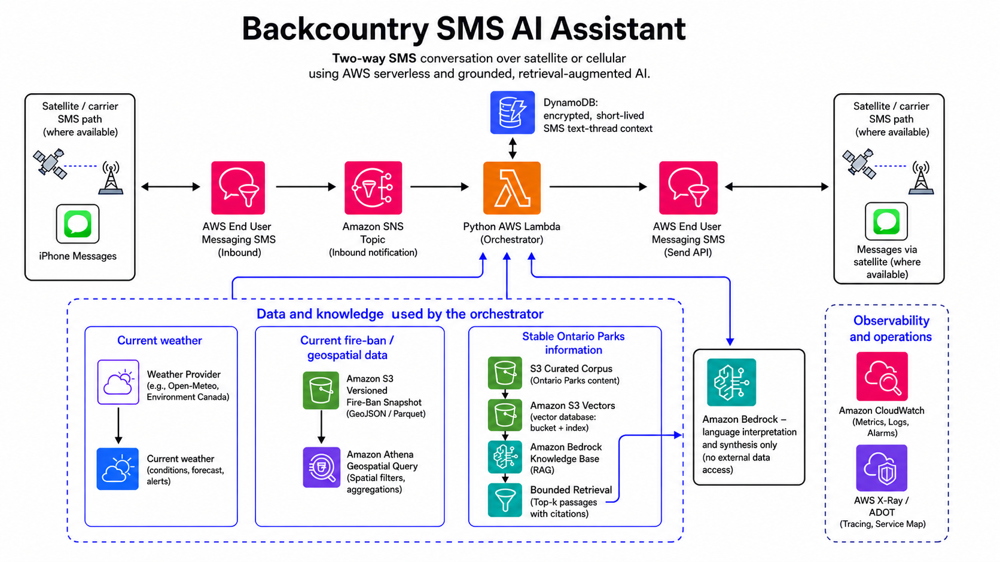

# Backcountry SMS AI Assistant

> A low-bandwidth, SMS-first AWS assistant for practical backcountry questions—and a working
> example of how to take a GenAI idea through architecture, implementation, evaluation, safety,
> observability, and cost-aware operation.

## Why I built it

The idea started while I was portaging a canoe through Algonquin Park. I was there for six straight
days, hours from civilization, with no dependable cellular service. Out there, trip planning is
continuous: how long will the next hop between camps take, will the rain change the route, is a fire
ban in effect, and did the team win last night? Getting useful information should not require
finding a signal, opening an app, and reconstructing a full online workflow.

Apple's satellite messaging makes a short-message interface increasingly practical. The phone can
send and receive a small SMS through the satellite path where the feature is available; the system
on the other end still has to do real work. A question that sounds simple may require resolving a
place name, retrieving current weather, checking authoritative operational data, searching stable
park information, and turning the result into a concise answer that fits an SMS.

That makes this a useful AI application engineering problem—not just a chatbot prompt. The system
has to decide what the model should do, what deterministic code should do, which sources are
authoritative, what data can be retained, how failures are handled, and how the result is evaluated
before it is trusted. It is a compact example of using an LLM where it adds value: interpreting an
ambiguous human question and composing a useful answer, while code and external systems handle the
facts.

## How I built it

This project was developed as a personal AI application engineering exercise using specification-
driven development with Codex on a personal ChatGPT Plus plan (the $20 reference is a dated setup
snapshot). The efficient Luna model was the main model used for implementation and review. I also
made heavy use of GPT-Live-1 voice conversations and ChatGPT iOS remote access to reason through
designs, coordinate work, and monitor delegated jobs while keeping deployment and release decisions
explicit.

The workflow is deliberately structured: define one bounded specification, implement it, test it,
perform an independent review, run the applicable validation gate, and only then perform explicit
deployment or live verification.

## Technical snapshot

Statically typed Python, AWS CDK, AWS Lambda, SNS, AWS End User Messaging SMS, DynamoDB, Amazon
Bedrock, Amazon S3, S3 Vectors, Athena, CloudWatch, X-Ray, pytest, Ruff, mypy, and CI/CD.

## Example interaction

These are synthetic examples showing the intended shape of the user experience:

```text
User:  What's the weather at Burnt Island Lake tomorrow?
Bot:   Burnt Island Lake: 12 C tomorrow, 60% chance of rain, gusts up to 28 km/h. Pack rain gear.
```

```text
User:  I'm in Toronto now. What's the weather?
Bot:   Toronto: 18 C today with a 30% chance of rain. Light winds. Source: live weather lookup.

User:  What about tomorrow?
Bot:   Toronto tomorrow: 16 C, 50% chance of rain. Bring a light shell.
```

```text
User:  What should I know before visiting Algonquin?
Bot:   The park guide covers access, facilities, camping areas, and trip-planning context.
       Current fire-ban status: a fire ban is in effect.
```

The assistant is intentionally concise: the SMS boundary is part of the product design.

## Apple satellite context

The iPhone makes this use case increasingly practical. On supported iPhone 14 or later models,
Messages via satellite can exchange iMessage or SMS when cellular and Wi-Fi coverage are
unavailable, including in Canada, subject to iOS, carrier, region, device, and environmental
conditions. Messages may take minutes to send, require a clear view of the sky, and can be affected
by trees or other obstructions.

This project does not integrate directly with Apple's satellite network. It provides an ordinary
SMS destination that can be reached through whatever connectivity path the user's phone and carrier
make available. Satellite messaging is one increasingly useful way to make that low-bandwidth
interface practical in the backcountry.

See [Apple's Canadian satellite guidance](https://support.apple.com/en-ca/105097) and [Apple's
Messages via satellite documentation](https://support.apple.com/en-euro/guide/iphone/iphb9262f4dd/ios)
for current device, regional, carrier, and environmental limitations.

## Architecture



The deployed core is a two-way SMS flow: satellite-enabled iPhone Messages reach AWS End User
Messaging SMS, which publishes the inbound notification to Amazon SNS and invokes the Python Lambda
orchestrator. Lambda uses the short-lived DynamoDB SMS text-thread context, provider lookups, and
Amazon Bedrock, then sends the reply directly through the AWS End User Messaging SMS API. The
satellite link is provided by the iPhone/carrier path; this application receives and sends ordinary
SMS through AWS.

The source-backed extensions add an Amazon Bedrock Knowledge Base backed by an Amazon S3 Vectors
vector database (vector bucket and index) over an S3-curated Ontario Parks corpus, plus versioned S3
fire-ban snapshots queried through Amazon Athena for geospatial lookups.

The Knowledge Base, S3 Vectors, S3 ingestion, and Athena paths are currently represented as local or
not-yet-live capabilities until their deployment and live verification are complete. SNS is used
for the inbound notification path; outbound SMS is sent directly by Lambda through the AWS End User
Messaging SMS API.

## AI application design

The LLM is not the system of record. The application uses deterministic code for authoritative
lookups, coordinate handling, source boundaries, output validation, SMS limits, and failure
behavior. The model is used for bounded language understanding and response synthesis.

Important design choices include:

- statically typed Python and explicit contracts at provider, retrieval, orchestration, and output
  boundaries;
- current-message precedence over bounded conversation history;
- instruction/data separation so user messages, history, and provider content are treated as data;
- bounded prompts, token ceilings, retries, context, model calls, and response length;
- a typical weather request uses two Bedrock calls: the first identifies intent and extracts the
  relevant location/time context, and the second synthesizes the answer from verified data;
- source-backed RAG for stable park information, while current weather, fire bans, closures, and
  availability remain on fresher authoritative paths;
- safe fallbacks when a provider, model, retrieval operation, or delivery path fails;
- layered application controls rather than a claim of comprehensive content moderation.

## Evaluation and testing

The project treats evaluation as a release concern, not a final demo flourish.

- Deterministic tests validate schemas, location precedence, coordinate preservation, expected
  model-call counts, SMS length, redaction, and offline no-network behavior.
- Model evaluations cover interpretation, history use, location extraction, and bounded responses.
- Provider evaluations cover named-place lookup, ambiguity, candidate ranking, and coordinates.
- Optional LLM-as-judge results provide qualitative assessment and uncertainty.
- Deterministic safety, privacy, schema, coordinate, call-count, and SMS-bound failures cannot be
  overridden by a judge score.
- Live provider and Bedrock checks are explicit and separate from ordinary CI.
- Carrier-independent capture mode allows deployed provider execution without sending carrier SMS.

## Model, performance, and cost decisions

Production uses Amazon Nova 2 Lite because it is capable for this bounded workload and available in
the production region. Nova Micro was compared through a separate test path: it was faster in the
observed sample, but regional availability and unresolved quality confidence did not justify a
production migration.

The project also measured client reuse, bounded caching, Lambda memory sizing, model-call latency,
and SMS delivery behavior. The larger Lambda memory configuration was not retained when the cost
trade-off did not justify it. The observed SMS quota behavior was a useful reminder that operational
limits outside the model can dominate the user experience.

At approximately 100 short interactions per month, the variable AI and serverless workload is
small. Nova 2 Lite usage is inexpensive for this bounded message volume; total cost still depends
on SMS origination/delivery, weather and location providers, logging, and any Knowledge Base or
Athena usage. Exact prices should be recalculated from current regional rates rather than treated as
permanent project facts.

See the detailed [performance findings](docs/performance.md).

## Operational boundaries and limitations

- The current assistant is allow-listed and intentionally narrow.
- Current fire bans, closures, weather, and availability require authoritative current sources.
- The static park guide is not a source of current operational status.
- SMS provider quotas, provider failures, and satellite environmental limitations remain real
  constraints.
- Long-term personal memory, broad autonomous-agent behavior, and multi-channel support are outside
  the current release boundary.

## Project status

The core SMS, weather, context, observability, tracing, reliability, performance, evaluation, and
carrier-independent test paths are deployed and verified. Fire-ban/geospatial and Ontario Parks
RAG capabilities are implemented locally but remain subject to their own review, deployment, data
ingestion, and live-verification gates.

The detailed internal status ledger is kept in [`STATUS.md`](STATUS.md). The repository also
contains [`AGENTS.md`](AGENTS.md), which documents the safety and AI-assisted development contract.

## Further reading

- [Measured performance findings](docs/performance.md)
- [Development workflow](development-workflow.md)
- [Evaluation harness](specs/stage-7-evaluation-harness.md)
- [Ontario Parks RAG specification](specs/stage-9.3.2-ontario-parks-rag-mvp.md)
